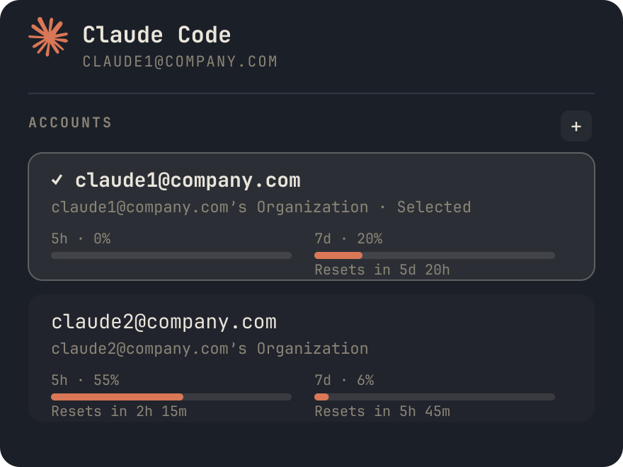

# cswap Accounts

An [Omarchy](https://omarchy.org/) bar widget that shows every
[cswap](https://github.com/realiti4/claude-swap)-tracked Claude Code account
with live 5-hour session and 7-day weekly rate limits, and switches the
active account with a click.



## Requirements

This widget is a display/control surface for **[claude-swap](https://github.com/realiti4/claude-swap)**
(CLI: `cswap`) — it does not manage accounts itself and has nothing to show
without it. You don't need to set any of this up by hand first: the panel
walks you through it.

- Omarchy with the shell plugin system (`omarchy plugin` commands available)
- [`cswap`](https://github.com/realiti4/claude-swap), which this widget shells
  out to for `cswap list --json` and `cswap switch <target>`
- `python3` (used by `bin/cswap-roster` to reshape `cswap`'s output)

If `cswap` isn't installed, the panel shows an **Install cswap** row —
click it and Omarchy opens a terminal running `uv tool install claude-swap`.
Once installed but before any account is registered, an **Add account** row
opens a terminal running `cswap add` (this is also how you add a second,
third, etc. account later — it stays pinned at the bottom of the account
list). Both just launch a terminal; nothing installs or authenticates
silently in the background.

## Install

```bash
omarchy plugin add https://github.com/<you>/cswap-accounts.git --enable
```

Or clone manually into `~/.config/omarchy/plugins/cswap.accounts/` — the
shell hot-reloads plugin code on save, no restart required.

## Use

- Click the bar icon to open the panel.
- Each row shows an account's email, org, session (5h) and weekly (7d) usage
  meters, and when each resets.
- Click a row to switch the active Claude Code account to it (via
  `cswap switch`).

## Configuration

| Key | Default | What it does |
|---|---|---|
| `refreshIntervalSec` | `300` | How often the account list is re-fetched from `cswap` |

```bash
omarchy bar set cswap.accounts refreshIntervalSec 120 --json
```

## License

MIT — see [LICENSE](LICENSE).
